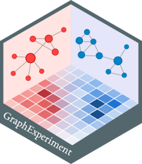

<!-- README.md is generated from README.Rmd. Please edit that file -->

```{r, include = FALSE}
knitr::opts_chunk$set(
    collapse = TRUE,
    comment = "#>",
    fig.path = "man/figures/README-",
    out.width = "100%"
)
```

# GraphExperiment 

<!-- badges: start -->
[](https://github.com/almeidasilvaf/GraphExperiment/issues)
[](https://lifecycle.r-lib.org/articles/stages.html#stable)
[](https://github.com/almeidasilvaf/GraphExperiment/actions/workflows/rworkflows.devel.yml)
[](https://app.codecov.io/gh/almeidasilvaf/GraphExperiment?branch=devel)
<!-- badges: end -->

**GraphExperiment** provides users and developers with infrastructure to
store quantitative data from omics assays along with networks representing
how features (e.g., genes, proteins, metabolites) interact with each other.
The `GraphExperiment` S4 class extends `SingleCellExperiment` to include
support for `igraph` objects.

## Installation instructions

Get the latest stable `R` release from [CRAN](http://cran.r-project.org/). Then install `HybridExpress` from [Bioconductor](http://bioconductor.org/) using the following code:

```{r 'install', eval = FALSE}
if (!requireNamespace("BiocManager", quietly = TRUE)) {
    install.packages("BiocManager")
}

BiocManager::install("GraphExperiment")
```

## Citation

Below is the citation output from using `citation('GraphExperiment')` in R. Please
run this yourself to check for any updates on how to cite __GraphExperiment__.

```{r 'citation', eval = requireNamespace('GraphExperiment')}
print(citation('GraphExperiment'), bibtex = TRUE)
```

Please note that the `GraphExperiment` was only made possible thanks to many other R and bioinformatics software authors, which are cited either in the vignettes and/or the paper(s) describing this package.

## Code of Conduct

Please note that the `GraphExperiment` project is released with a [Contributor Code of Conduct](http://bioconductor.org/about/code-of-conduct/). By contributing to this project, you agree to abide by its terms.
