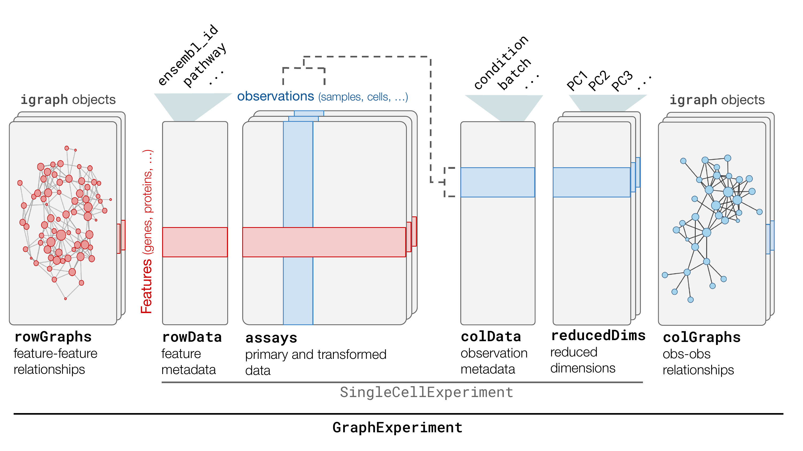

<!-- README.md is generated from README.Rmd. Please edit that file -->

# GraphExperiment 

<!-- badges: start -->

[](https://github.com/almeidasilvaf/GraphExperiment/issues)
[](https://lifecycle.r-lib.org/articles/stages.html#stable)
[](https://github.com/almeidasilvaf/GraphExperiment/actions/workflows/rworkflows.devel.yml)
[](https://app.codecov.io/gh/almeidasilvaf/GraphExperiment?branch=devel)
<!-- badges: end -->

**GraphExperiment** provides users and developers with infrastructure to
store quantitative data from omics assays along with networks
representing how features (e.g., genes, proteins, metabolites) interact
with each other. The `GraphExperiment` S4 class extends
`SingleCellExperiment` to include support for `igraph` objects.

The figure belows summarizes the `GraphExperiment` class in comparison
to the `SingleCellExperiment` class.



## Installation instructions

Get the latest stable `R` release from
[CRAN](http://cran.r-project.org/). Then install `HybridExpress` from
[Bioconductor](http://bioconductor.org/) using the following code:

``` r
if (!requireNamespace("BiocManager", quietly = TRUE)) {
    install.packages("BiocManager")
}

BiocManager::install("GraphExperiment")
```

## Citation

Below is the citation output from using `citation('GraphExperiment')` in
R. Please run this yourself to check for any updates on how to cite
**GraphExperiment**.

``` r
print(citation('GraphExperiment'), bibtex = TRUE)
#> Warning in citation("GraphExperiment"): could not determine year for
#> 'GraphExperiment' from package DESCRIPTION file
#> To cite package 'GraphExperiment' in publications use:
#> 
#>   Almeida-Silva F, Van de Peer Y (????). _GraphExperiment: S4 Classes
#>   for Quantitative Data and Associated Networks_. R package version
#>   0.99.0.
#> 
#> A BibTeX entry for LaTeX users is
#> 
#>   @Manual{,
#>     title = {GraphExperiment: S4 Classes for Quantitative Data and Associated Networks},
#>     author = {Fabricio Almeida-Silva and Yves {Van de Peer}},
#>     note = {R package version 0.99.0},
#>   }
```

## Code of Conduct

Please note that the `GraphExperiment` project is released with a
[Contributor Code of
Conduct](http://bioconductor.org/about/code-of-conduct/). By
contributing to this project, you agree to abide by its terms.
